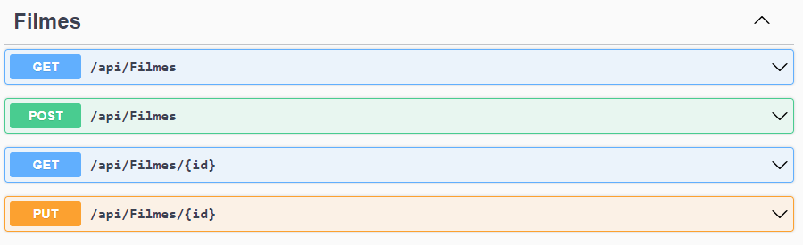

# GncCinemas
Projeto de conclusão do curso de Asp.Net avançado.

Este projeto se resume a uma aplicação Asp.Net Core Web API para gerenciar vendas de ingressos para um pequeno cinema da cidade.

# Endpoints

## Fluxo básico para utilização dos endpoints

1. Criar Filmes
2. Criar Sessões para os Filmes
3. Realizar a vende de Ingressos para uma determinada Sessão




# Banco de Dados
Esta aplicação roda sobre um container Docker Microsoft SQL Server 2019.

https://hub.docker.com/_/microsoft-mssql-server

Abaixo o schema do banco de dados:

```sh
CREATE DATABASE [gnccinemas]
GO
USE [gnccinemas]
GO
CREATE TABLE [dbo].[filmes](
	[id] [uniqueidentifier] NOT NULL,
	[titulo] [varchar](50) NOT NULL,
	[duracao] [int] NOT NULL,
	[sinopse] [varchar](100) NOT NULL,
 CONSTRAINT [PK_filmes] PRIMARY KEY CLUSTERED 
(
	[id] ASC
)WITH (PAD_INDEX = OFF, STATISTICS_NORECOMPUTE = OFF, IGNORE_DUP_KEY = OFF, ALLOW_ROW_LOCKS = ON, ALLOW_PAGE_LOCKS = ON, OPTIMIZE_FOR_SEQUENTIAL_KEY = OFF) ON [PRIMARY]
) ON [PRIMARY]
GO
CREATE TABLE [dbo].[sessoes](
	[id] [uniqueidentifier] NOT NULL,
	[dataexibicao] [date] NOT NULL,
	[horarioinicio] [varchar](5) NOT NULL,
	[quantlugares] [int] NOT NULL,
	[quantlugaresreservados] [int] NOT NULL,
	[valoringresso] [decimal](10, 2) NOT NULL,
	[idfilme] [uniqueidentifier] NOT NULL,
	[hashconcorrencia] [varchar](32) NOT NULL,
 CONSTRAINT [PK_sessoes] PRIMARY KEY CLUSTERED 
(
	[id] ASC
)WITH (PAD_INDEX = OFF, STATISTICS_NORECOMPUTE = OFF, IGNORE_DUP_KEY = OFF, ALLOW_ROW_LOCKS = ON, ALLOW_PAGE_LOCKS = ON, OPTIMIZE_FOR_SEQUENTIAL_KEY = OFF) ON [PRIMARY]
) ON [PRIMARY]
GO
CREATE TABLE [dbo].[ingressos](
	[id] [uniqueidentifier] NOT NULL,
	[idsessao] [uniqueidentifier] NOT NULL,
	[quantidade] [int] NOT NULL,
	[valortotal] [decimal](10, 2) NOT NULL,
 CONSTRAINT [PK_ingressos] PRIMARY KEY CLUSTERED 
(
	[id] ASC
)WITH (PAD_INDEX = OFF, STATISTICS_NORECOMPUTE = OFF, IGNORE_DUP_KEY = OFF, ALLOW_ROW_LOCKS = ON, ALLOW_PAGE_LOCKS = ON, OPTIMIZE_FOR_SEQUENTIAL_KEY = OFF) ON [PRIMARY]
) ON [PRIMARY]
GO
```
